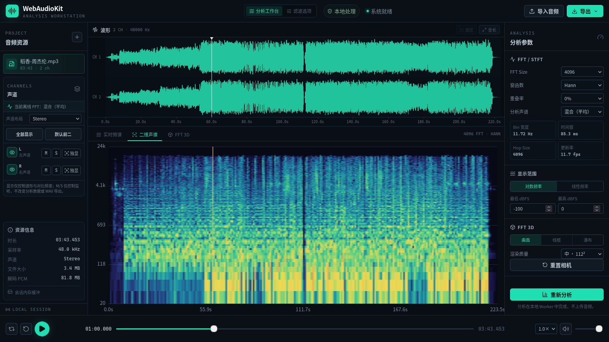
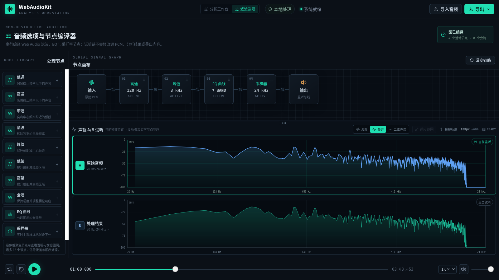
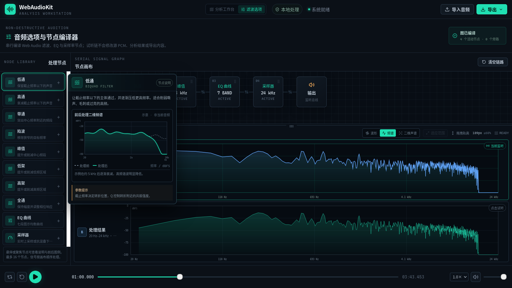

# WebAudioKit

WebAudioKit 是一个本地优先、非破坏式的浏览器音频分析工作台。音频默认只在当前浏览器中解码、播放、分析和导出，不上传到服务器。

## 界面预览

### 音频分析工作台



### 滤波节点工作台



### 节点说明与效果图例



> 示例音频：周杰伦《稻香》。音频仅用于生成界面预览，未包含在本仓库中。

## 当前能力

- 拖拽或批量导入浏览器可解码的音频，WAV 为基线格式
- 采样点精确的播放、暂停、停止、跳转、选区循环、音量和倍速
- 多分辨率多声道波形、任意声道显隐/独显、滚动浏览、选区、缩放和平移
- 每声道播放 Mute/Solo，以及 Mono、Stereo、Quad、5.1、7.1 与离散声道语义标签
- 统一 Hann/Hamming/Blackman 窗与 dBFS 标定的 FFT/STFT，可选择混合或任意源声道分析
- Worker 驱动的单声道或多声道同步实时频谱对比、二维声谱预览和 Three.js FFT 3D 曲面/线框/瀑布视图
- 全文件或选区 WAV 导出：PCM16、PCM24、Float32、可选峰值归一化
- CSV/JSON 分析数据导出
- IndexedDB schema v3 保存分析参数、分析声道、可见声道、Mute/Solo、声道布局、频谱对比、选区和最近工作区状态
- WebGL2 不可用时保留播放、波形和二维分析能力

## 开发

环境要求：Node.js 24+、npm 11+。

```bash
npm ci
npm run dev
```

质量检查：

```bash
npm run check
```

单独命令包括：

```bash
npm run lint
npm run typecheck
npm test
npm run build
```

## 工程结构

```text
src/audio/          FFT、STFT、窗函数、播放引擎、导入与 WAV 编码
src/workers/        分析、峰值和导出 Worker 及版本化 Client 协议
src/components/     波形、频谱、声谱、3D、播放与参数界面
src/state/          可序列化的 IndexedDB 项目状态
src/visualization/  色板、坐标与格式化工具
```

完整产品范围见 [PRD](docs/PRD.md)，架构和数学口径见[技术设计](docs/TECHNICAL_DESIGN.md)。贡献前请阅读 [AGENTS.md](AGENTS.md)、[CONTRIBUTING.md](CONTRIBUTING.md) 和 [Git 规范](docs/GIT_CONVENTIONS.md)。

## 已知边界

- MVP 使用 `decodeAudioData` 完整解码，超长音频仍受浏览器内存限制。
- 当前 Worker 会复制任务所需 PCM，工作区常驻解码 PCM 默认硬上限为 512 MiB；估算工作集超过软预算时不自动执行全文件 FFT。
- 非 WAV 输入能力取决于当前浏览器与操作系统解码器。
- 音频导出只保证 WAV；压缩编码不在当前版本范围内。
- 波形显隐和 FFT 声道选择不改变播放或 WAV 导出；每声道 Mute/Solo 仅影响监听，WAV 仍保留全部源声道。5.1/7.1 当前为身份顺序标签，实际扬声器能力由浏览器、系统和输出设备决定。
- 3D 引擎按需加载，WebGL2 不可用时自动降级。
